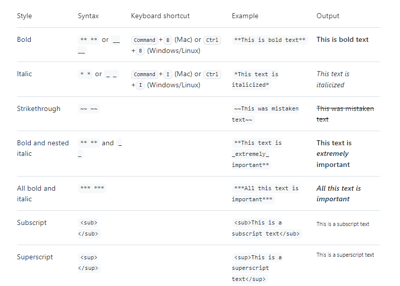

# ~~A LONG TITLE~~ _italic?_ or juste **bold**, maybe ***both***?

> quoto something

> blablabla
> blablablablabla

btw this link linked to [Github](https://github.com/) and this one linked to this [repo](https://github.com/HXL916/test-md).

Why doing that? multiples reasons
- try to understand how md work.
- try to get used of git with CLI.
- it is necessary, what can I say?

Tasks?
- [x] git:+1:
- [x] md:+1:
- [ ] test

<!-- this is hiding -->
